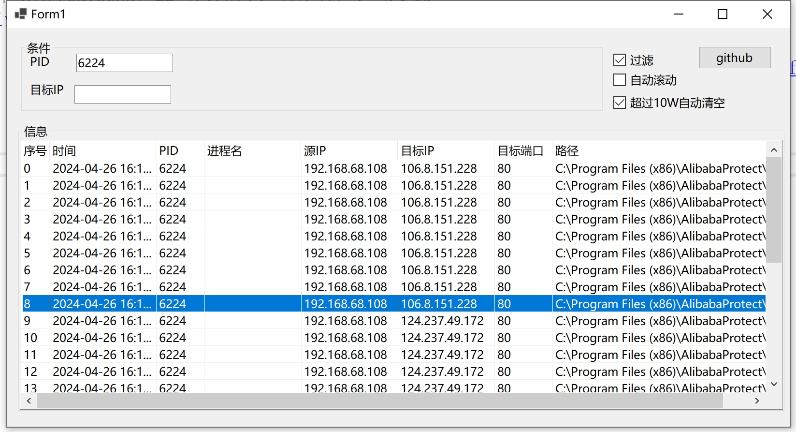

# SamWafIpMonitor

## 介绍
SamWafIpMonitor是一个监控本地向外访问的80/443端口的安全辅助小工具。
 

## 功能
可实时查看：
- 发起IP
- 发起程序名称
- 发起程序所在位置
- 目标IP
- 目标端口

## 技术细节
- 程序基于.net core 6,
- 依赖 老九 封装库 [WindivertDotnet](https://github.com/xljiulang/WindivertDotnet)

## 运行注意事项

1.运行需要管理员权限

## 免责条款：

切勿用于非法用途,风险自负!。
